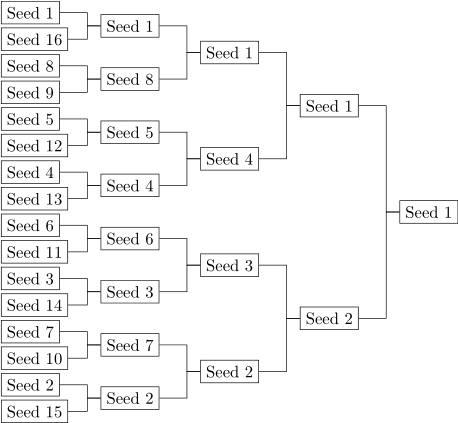

## Lecture 6 part 1

- [Lecture 6 part 1](#lecture-6-part-1)
  - [Finding min and a second min](#finding-min-and-a-second-min)
    - [Run time considerations](#run-time-considerations)
    - [Why can you find a second min with logarithmic number of comparisons but not the first min?](#why-can-you-find-a-second-min-with-logarithmic-number-of-comparisons-but-not-the-first-min)
    - [Space considerations](#space-considerations)
  - [Data structures](#data-structures)
    - [Second min code](#second-min-code)
      - [Combine operation (add_to_counter)](#combine-operation-add_to_counter)
        - [reduce_counter](#reduce_counter)

### Finding min and a second min

We will now discuss a problem where we want to find the first min as usual but we also want to find the second min.

#### Run time considerations

We know that in order to find min, we will need `n-1` comparisons (as discussed in previous lectures).

The idea of finding the second min stems from the player seedings in tennis tournaments. In order for tournament to be fair, it is important that the final game is played between the two strongest players.
At the same time, not everyone can play with everyone. So the games are arranged in a binary tree. See this example:



Here, the winner had to win 4 matches. i.e. $\lceil ln(n) \rceil$ (ceiling on log base 2 n) matches and beat $\lceil ln(n) \rceil$ players, where n is 16 in this case.
It is also obvious that the seed#2 player had to win $\lceil ln(n)-1 \rceil$ matches and that seed#2 lost ONLY one match and that was against seed#1.

What this means is:

- the winner of the tournament (seed #1 and our min) will not have lost any matches
- the runner up (our second min) will have lost only one match (i.e. the final match) and only against the winner (our min)

So once the winner is decided, we want to find the second winner for the remaining subset i.e. `n-1`.
We know that the winner had to win $\lceil ln(n) \rceil$ matches for n players. So, the runner up will have to now win $\lceil ln(n)-1\rceil$ matches.

Putting all of this together, we need:
`n-1` comparisions to find the min + `ln(n) - 1` comparisons to find the second minimum = total of `n + ln(n) - 2` comparisons.

#### Why can you find a second min with logarithmic number of comparisons but not the first min?

This because we already know an important property that seed#2 loses only 1 game and only against the seed#1

- So, if seed#2 loses only and only 1 game, only seed#2 can make it to the rightmost but one position to matchup with seed#1 for finals
- And this is where the seed#2 will lose to seed#1.

#### Space considerations

There are two steps to this alorithms.

1. Finding the min and we already know how much space we need for it
2. Finding the second min in logarithmic time. As we discussed above, we need history for this. And this history is the part where we could potentially use lots of space. But, observe that we don't technically need to save a lot of history. In the tree above, when we're done comparing two seeds we're ready to go a level to the right and discard the history. In other words, we really only need to store players with the same seed at a time. So, if there's a player who is "knocked out", we don't need to keep him around in the memory.

If we can't do all the comparisons "in-place", a logarithmic storage is acceptable. In practise, the logarithmic storage would not exceed 64.

In order to find second minimum in logarithmic time, we need to transform a linear sequence into a binary tree. It's important to understand that we can do this rearrangement because this group of numbers is associative. i.e. you can regroup them as you wish, but at the end, the result will still be the same. e.g. you can find a min between (1,4) and (3,6) and then between (1,3). Or you can find a min between (1,3) and (4,6) and then between (1,4), the end result will still be the same, i.e. 1.

### Data structures

Let's first discuss what we're going to compare. This is where the concept of parities comes into picture. The idea is that, we want to be comparing (i.e. create a match-up of) numbers of the same level/weight.
The idea is this:

- take array of booleans of length 32 initialized to all 0s at all indexes. The 0 at index m represent that no one has won m number of games. (i.e. 0 at index 5 will mean, nobody has won 5 games)
- take the first number, it has won 0 games so far, so "combine" it with 0th index, propogate the carry, and leave it there for a while
- take the next number. This will have won 0 games as well, so "combine" it with the number at 0th index
- Whoever won the above matchup, will have won 1 game now. And now it should be carry propogated to index 1

In order to put those numbers there, we'd need to figure out how to "combine" these numbers. So, we will need a combine function.

For example, we'll take the sequence [11, 10, 19, 13, 18, 4, 15].
This is an array of size 7. So, we will need a counter of size $\lceil ln(7) \rceil$ = 3
In the table below, `z` is a marker that signifies an empty space where any value `x` can be stuck in.
In other words, `combine(z,x) = x` i.e. combining x and z will just give back `x`.
Following table shows how the counter works after each `add_to_counter` operation.

The table below shows how this counter is implemented using binary carry propogation style.
We have replicated counting up from 000 to 111. In each step, we're

- adding in an element from the sequence to the counter
- performing `combine` operation
  This combine operation is actually a comparison (cmp) operation such as `std::less` as we will see in lecture7

| Value | cnt[0] | cnt[1] | cnt[2] | return | comment                                                    |
| ----- | ------ | ------ | ------ | ------ | ---------------------------------------------------------- |
| Init  | z      | z      | z      | -      | cnt = zzz                                                  |
| 11    | 11     | z      | z      | 11     | cnt[0] was z, so 11 gets stuck at cnt[0]                   |
| 10    | z      | 10     | z      | 10     | cnt[0] was 11. cmp(11,10) = 10. 10 advances to next index  |
| 19    | 19     | 10     | z      | z      | cnt[0] was z, so 19 gets stuck at cnt[0]                   |
| 13    | z      | z      | 10     | 10     | cnt[0] was 19. cmp(13,19) = 13. 13 advances to next index. |
|       |        |        |        |        | cnt[1] was 10. cmp(10,13) = 10. 10 advances to next index. |
| 18    | 18     | z      | 10     | z      | cnt[0] was z, so 18 gets stuck at cnt[0]                   |
| 4     | z      | 4      | 10     | z      | cnt[0] was 18. cmp(18,4)= 4. 4 advances to next index      |
|       |        |        |        |        | cnt[1] was z. so 4 gets stuck at cnt[1]                    |
| 15    | 15     | 4      | 10     | z      | cnt[0] was z, so 15 gets stuck at cnt[0]                   |

There are a couple of things to note here:

- The table above only shows how add_to_counter works. i.e. how we can fit n things in log(n) space with std::less combine operation. This is not the whole algorithm. A `reduce` operation has to happen on this counter to find the min and second min
- This "binary counter device" automatically makes sure that only the numbers of the same strength (players of the same seed) are combined/compared. This is done by advancing the element that has won a comparison to the next index. If advancing to next index results in another comparison, we do that as well. For example, in above table, when we add 13 to counter, it gets compared to 19 and wins. So, it advances to next index. The next index is not empty and has 10 sitting there. This results in another comparison, in which 10 wins and advances to index 2.
- Also note that we don't need the combine operation to be commutitive. i.e. we expect the outcome of `combine(a,b)` to be the same as `combine(b,a)`. But to maintain stability, we must keep the oldest element to the left when we do `combine(left, right)`

#### Second min code

Let's think about the data structure later. Let's start with something very basic i.e. the combine function. What we know about it so far is:

- it is a binary operation (i.e. it operates on two operands)
- it will operate on a data type of the elements in the array (let's call it T)
- it needs to continuously give the feedback to the caller as to whether we were able to put the number in a particular position or not. And we know that the datastructure to keep track of this contains either all 0s or the element of type T who has won x number of matches, where x = index. So return type will be T. To further explain:
  - if there was a zero where we're sticking the element in, we return zero
  - if there was another element where we're going to stick this element in, we return the carry. So, for example in the table above, at row#3, 10 got combined with 11 and the result was 0 with carry 21, so we will return the carry 21

So, below we have

- typename T: This is the datatype of the elements
- typename I: This is for the iterator that iterates over a collection of items of type T
- typename Op: This is the binary operator type itself

##### Combine operation (add_to_counter)

```cpp
// The combine operation

template <typename T, typename I, typename Op>

// requires Op is BinaryOperation(T)
// and Op is associative
// I is forward iterator and ValueType(I) = T

T add_to_counter(I first, I last, Op op, const T &zero, T carry)
{
  // precondition: carry != zero
  while (first != last)
  {
    if(*first == zero)
    {
      *first = carry;
      return zero;
    }
      carry = op(*first, carry);
      *first = zero;
      ++first;
  }

  return carry;
}
```

In the code above:

- the argument `zero` is just some marker of "emptiness". For example, NULL. So that, we can compare the value at a position with it and see if it's empty.
- notice that carry is pass by value - this is because we want to reuse it as an accumulator to same temporary result and therefore need to modify it within the loop. Especially if a variable is going to be modified within a loop, we should keep it as close (within the same stack frame) as possible. Hence, pass by value makes sense in this case. Passing it by reference would've meant that the loop modifies the accumulator which is sitting somewhere else in a different stack frame and thus it'll be slow.
- in the combining operation `op` \*first and carry arguments' order matters because `op` is not a commutitive operation. And we've chosen to pass first as the first argument because it was already to the left of carry (I didn't understand this part)
- we have done `*first=zero` at line 848. This is because in binary operations, 1+1 = 10, i.e. 0 with carry 1. We also want to keep this counter as clean as possible and keep the bit array balanced. Balancing is important because we're trying to fit n elements in log(n) size bit array.

###### reduce_counter

Now that we have an algorithm for adding things to counter, we can start thinking about the higher level algorithm to take things one by one and reduce the counter. The idea here is to be greedy and start reducing the smaller sub-trees into bigger sub trees and kind of merge them together.
Notice that in the table above, the elements that come last are to the left in the binary counter. So, left side is the smaller subtree.

In algorithms that involve comparing / combining numbers, we always need to make sure that we combine/compare numbers of equal parity / weight. This is because of the limitations of computers. Smaller quantities tend to get ignored when added to huge numbers, leading to wrong results.
e.g. if we add 0.0000000001 to 10000000 and add 0.0000000002 to another 10000000 and then compare 10000000.0000000001 and 10000000.0000000002, the computer may see them as equal numbers.
Therefore, in reduction algorithms like these, we always want to combine (reduce) smaller numbers first and then work up to bigger numbers.

We also need to think about initializing the counter in a little more detail here. So far, we've called `zero` as a marker of emptiness. i.e. in `add_to_counter` we checked if the element at a particular index is `zero` and if yes, we concluded that that index was empty and we stuck `T` in there. This process assumed that the counter was already initialized. But what if we're dealing with `int` type `T` and our `zero` is same as int 0? Then we won't know the difference.
So, the idea is that we can't initialize our result (i.e. the couter) till we find the first non-zero.

Continuing from the above example where the add_to_counter resulted in a counter with elements {15,4, 10}, the reduction algorighm will work as follows:

- we find the first non-zero value i.e. 15 here, result = 15
- we start iterating to the end of the array while combining non-zero elements
  - 15-4 matchup, 4 wins, result := 4
  - 4 -10 matchup, 4 wins, result = 4 

```cpp
template <typename T, typename I, typename Op>

// requires Op is BinaryOperation(T)
// and Op is associative
// I is forward iterator and ValueType(I) = T

T reduce_counter(I first, I last, Op op, const T &zero){
  // keep going until we find the first non zero element
  while(first != last && *first == zero){
    ++first;
  }
  //we may have exited the last loop because if first == last
  if(first == last){return zero;}

  // store the first non zero element
  T result = *first;

  // then iterate
  //(now we're iterating from the first non zero element to the end)
  while(++first != last){
    if(*first != zero){
      // update the result
      result = op(*first, result);
    }
  }

  return result;
}
```
