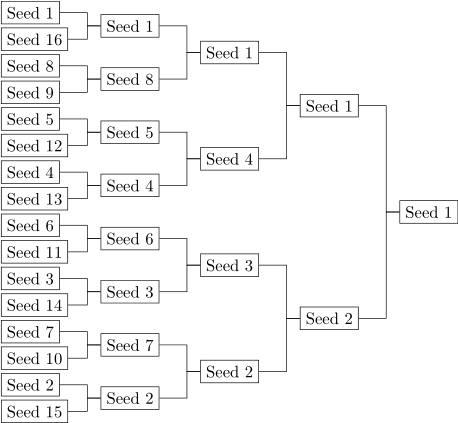

# Efficient Programming in C++

These notes are written with reference to video lectures here:
[YouTube](https://www.youtube.com/watch?v=aIHAEYyoTUc&list=PLHxtyCq_WDLXryyw91lahwdtpZsmo4BGD)

## Introduction lecture Part 1

- Always use the simplest data structure possible. In C++, **USE VECTORS!** if you can. If you can't use vectors, figure out a way to **USE VECTORS**
- An example discussed in the class discusses why using a combination of `std::sort` and `std::unique` for finding number of unique elements in an array is better than using a `set`. (The reason is that set is designed to efficiently handle the constant growing and shrinking i.e. insertions and removals. And if you have a big list of elements, constructing a set itself will take a lot of time and we will never be able to reap the benefits of using a set, because we're not really going to insert and remove from the set multiple times)

## Introduction lecture Part 2

- When we write some code, it is essential to determine how efficient it is. There is no need to ALWAYS go into big O analysis. Instead, there are some things we can do to benchmark the code performance, WITHOUT modifying the original code at all.
- When STL library was written, the goal was to make the STL libraries work for all built-in datatypes, but also pointers and datatypes that are "like" built-in datatypes. To make non built-in types to behave like built-in types, some containers were written (as wrappers?). e.g. a vector of strings will accept a string as a template parameter and provide another type, that's a vector of strings. These containers were to support the operations that a regular datatype supports. And thus different algorithms (like sorting) can directly run on these datatypes.

- **Semiregular types:** These are the datatypes that provide only constructor, destructor and assignment.
- **Regular types:** (a.k.a Totally ordered types): Like Semiregular, but also supports equality and maybe non-equality too (i.e. == and !=)
- So, what kind of operations do we really need to count? The answer is - whatever operations a regular datatype may reasonably support. Regular datatype being, a datatype that is expected to behave like a built-in datatype, like `int` for example. For instance, when you construct a vector of `int`s, the vector itself can be expected to support reasonable operations that `int` may support. So, these operations are:
  - copy: For example, copy constructor, stuff like vector a = b
  - assign: For example, we have T a, and T b, and we do a = b (i.e. assigning one already constructed object to other)
  - default: Default constructor for example, T a;
  - destruct: as the name says, destructor
  - equal: For example, a == b. Note that the measure of equality is different for different types.
  - compare

### Lecture 1 class assignment

- The goal here is to write some code that counts number of different types of operations above by doing something like:

```cpp
  count_operations(16, 16 * 1024 * 1024, sort_functor());
```

- Sort functor above is basically a wrapper around a regular C++ standard sort function. See functorized.h for this. `std::sort` takes the beginning and the end of the iterator as arguments. So, the implementation of count_operations constructs a random vector and passes iterator beginning and end of that vector to sort_functor
- sort_functor is taken as a "pointer to a function" type argument by count_operations
- The idea is that, std::sort calls different operations on the iterator that is passed to it. We are simply providing

## Lecture 2

Intro lecture ended on a note that the goal for the entire class is to write identical code for the same problem. Subtle conventions are necessary to achieve this. For example, when to capitalize something, when to use what alternative, even though the two alternatives are synonyms etc. Following are the examples discussed at the beginning of lecture:

- when we use template and do something like `template<typename T>` or `template<class T>`, although the two declarations mean the same, one is indicative that the template parameter is an actual class, vs probably a primitive datatype. Also, pay attention to capitalized T. Capitalization is convention here.
- Use of struct vs class: We know that the difference between two in cpp is just the default scope of class members. i.e. in struct, class members are public by default. But there is a deeper reason behind when to use what.
- Public vs Private: Discussed that the common understanding that class properties should ALWAYS be private is BS. Private is only requires when "invariance" is important. Meaning that, you actively want to prevent someone or something from writing anything to that class property.
- Writing a complete class:

  - To make things as simple as possible, we will write a class called Singleton class.
  - Singleton class is not the same as singleton design pattern. It is a class that only has one thing. Let's call that thing as some value. This value can be any datatype like int, float, double, a pointer. So, we will make it a template class
  - Our goal is to take a type T and make it into another type. Which, in this case, will be a singleton wrapped around T.

### Semiregular methods of singleton classs

- Remember the definition of a **semiregular**. It needs to have a constructor, destructor and should be copyable/assignable. As such, it will need the following:
  - a default constructor
  - a destructor
  - a copy constructor
  - assignment operator
- By making the class semiregular, we want it to behave as a normal person would expect it to behave. e.g.

`T a(b);` should have the same effect as `T a = b;` in terms of the result and hopefully the performance too. Note that in the first case, a copy constructor is invoked and in the second case a default constructor followed by an assignment operator is invoked.

- **copy constructor:**
  Compiler implicitly synthesizes copy constructor for you. i.e. compiler will automatically write something like this for you:

```cpp
singleton(const singleton& x): value(x.value) { // do nothing here}
```

Remember the NPTEL discussion where it was discussed that compiler will copy a class reference passed as an argument to the copy constructor byte by byte. This is the same thing. Because singleton has only one member value, this member will be copied implicitly, in case copy constructor is not overridden by the programmer.
There is of course a caveat here. That is, in our case, singleton is a templated class and the template parameter could be a pointer too. So, in an implicitly defined (aka compiler provided) copy constructor, a pointer will be copied instead and the pointer being a member of some other class could be invalid at any time.

- **Default constructor:**
  For singleton class this will just be an empty function like this:

```cpp
singleton(){// do nothing}
```

We could have done something like:

```cpp
singleton() : value()
{

}
```

i.e. initialize value with an empty of a default value (e.g. int value to 0) by doing value().
But we don't want to do this because compiler will do it for you anyway.

- However, firm advice with respect to default constructor is that, you should only rely on default constructor to create something for you. But you should not rely on default constructor to initialize the members etc. to their default values. If you want members to be at their default values, then construct the class and then assign the values. This will also take care of the invalid pointer corner case that was discussed above.
- It is also very unsafe to rely on the presence of default constructor even though compiler synthesizes for you. But the moment you declare another signature for a constructor, compiler will not synthesize a default constructor for you.
- Some classes will not need any other constructors other than copy and default constructors -- these are the classes with no members (e.g. std::plus)
  - In order to understand this, let's inspect what other types of constructors there are:
    - Revisit this later
- What other constructors do I need for singleton other than copy and default?? Think about it

  - Revisit this also

- **Destructor:**
  This is as simple as:

```cpp
~singleton(){}
```

- Even though there is a templated class member T (which could be an object or even a pointer of any kind) in singleton class, we don't need to explicitly clean it up, because compiler does it for you.
- Also, if we didn't explicitly define the destructor, compiler will synthesize one for you.

- **Assignment operator**:
  Here we're talking about = operator, which will allow us to do somethig like this:

```cpp
singleton<T> a;
singleton<T> b;
singleton<T> c;

a = b = c;
```

As we know, a=b essentially translates to `a.operator=(b)`, meaning that user is calling operator= function on a with b as argument.
In case of singleton class, who has only one member called T value, the only logic that needs to be implemented is the copying of b.value to a.value. However, to support the chain assignment, the = operation should also return the result of operation, which is the assigned value itself. So, the operator= implementation would look like this:

```cpp
singleton& operator=(singleton x)
{
  value = x.value;
  return *this;
}
```

We return \*this here as a reference to the instance of this class. this means, in case of a=b=c, when b=c is done, a reference of a is assigned with b.

### Regular methods of singleton class

- To make singleton a regular class, we need to add the following methods:

1. Equality

- Here we want to implement == operator. == operator takes two arguments and returns true if they're "equal". The meaning of equal can get complicated when we're talking about complex datastructures.
- Also realize that in case of == operator, we're not really calling a member function on a class. Instead, what we're doing is, invoking a function in a global scope that takes two arguments and returns the equality status.
- This function however needs to have access to class's private data members. Therefore, it should be declared as a friend function within singleton class
- Where should this function be defined?

  - Being in global scope, it can be defined globally, but that complicates the syntax
  - Instead, you should define this function in the class itself

- So, here's what the function will look like:

```cpp
friend
bool operator==(const singleton& x, const singleton& y){
  return (x.value == y.value);
}
```

2.Inequality: Same as above. However, there are two ways to do it:

```cpp
// option1: Bad option because it's independent of equality and potentially will require more code to be changed in case code change is required
friend
bool operator!=(const singleton& x, const singleton& y){
  return (x.value != y.value);
}

// option2: This will always work as long as == is working
friend
bool operator!=(const singleton& x, const singleton& y){
  return !(x == y); // this is invoking == operator in turn
}
```

#### Some interesting discussion about Templated classes

- We know that compiler synthesizes a few things for user, if the user doesn't define them explicitly. e.g. copy constructor, default constructor etc.
- We also know that not all template types T can be "regular" classes. i.e. they probably don't support equality.
- In such a case, if the template parameter T does not _NEED_ a particular method, compiler will not synthesize it.
- In other words, if T is semiregular, Singleton<T> is also semiregular
- if T is regular (aka totally ordered), Singleton<T> is also regular
- Also note that compiler doesn't generate things until they're used

### Totally ordered methods of singleton class

- There are 4 methods that need to be defined to make the singleton class totally ordered.
- There are 4 methods because these methods always come in groups because we want to maintain the symmetry. i.e. if you define `<` operator, you should also define `>` operator. And if you define `<=` you should also define `>=`
- We saw that we used == operator as a baseline for !=. Same can be done here. i.e in case of comparison, we will select `<` operator as default operator. This choice is kind of arbitrary, but not really. Because, you can expect users to be wanting to sort a group of numbers etc. in an ascending order more often than in decending order. And in sorting algorithms that will be done by using `<` comparison. i.e. if a < b, put b before a. What we mean to say here is that because Singleton needs to be a "complete" class, an STL algorithm should also be able to sort a bunch of singletons. And thus, we want to, as a starting place, start by providing an implementation for `<` operator.

- So the implementation would looks like this:

```cpp
// this should work for x < y (i.e. arg1=x, arg2=y)
friend
bool operator<(const singleton& x, const singleton& y){
  return x.value < y.value;
}

// this should work for x > y (i.e. arg1=x, arg2=y)
// notice how we're reusing the < implementation
// this is because x > y implies y < x
friend
bool operator>(const singleton& x, const singleton& y){
  return y < x;
}

// this should work for x <= y
// x <=y implies y is NOT less than x
friend
bool operator<=(const singleton& x, const singleton& y){
  return !(y < x);
}

// this should work for x >= y
friend
bool operator>=(const singleton& x, const singleton& y){
  return !(x < y);
}
```

### Conversion methods of Singleton

- These are the methods that allow conversion from T to Singleton<T> and from Singleton<T> to T.
- Background:
  - If there exists a class that has a constructor with a single parameter, it is possible to convert the parameter to the class and vice versa. Here's an example:

```cpp
// this is the class with single parameter constructor
MyClass
{
  public:
  MyClass(int x)
  {
    _x = x;
  }

  private:
  int _x;
}

// We can instantiate this call using something like this:
MyClass mc = 3;
```

- What's happening above is an "implicit conversion", same as below:

```cpp
double a;
int b;
a = b; // conversion from int to double will happen here.
```

- Why do implicit conversions exist?
  - This is because C++ intended to keep its compatibility with C .
  - C had to support implicit conversions to avoid providing separate definition for different datatypes. e.g. sqrtint, sqrtfloat etc.
  - So, instead the writers of C language introduced implicit conversions that allowed implicit upcasting of dataype to the broadest possible datatype. e.g. A pointer can be upcasted to bool (when we do if (pointer), pointer is implicitly imterpreted to a boolean type). A boolean in turn can be upcasted to int and int can be upcasted to float etc.
- This implicit typecasting works out for C. But for C++ things get more complicated. e.g. in C++, `std::cin << 10;` compiles. Because in C++ when std::cin fails, it will be return a void pointer to NULL, which is 0 and so 0 << 42 becomes a left shift operation
- so, to fix this situation, there are additional set of rules that are introduced in C++. One workaround is to disable a conversion using `explicit` keyword. But then it messed up while, if and other conditionals. So an exception was made to allow implicit conversions only for these conditional cases.

- **Conversion from T to singleton<T>**
- It would need
  - a constructor with a single parameter for sure
  - the parameter will be T (a const reference to it actually)

```cpp
singleton(const T& x): value(x)
{

}

// this will allow for something like:

// implicit
singleton s = x; // where x is of type T

//explicit
singleton s(x);
```

- This looks exactly the same as copy constructor. Except, copy constructor takes as it's input a reference to a singleton class and here the function is accepting a raw T value reference.
- In order to avoid implicit creation of object using T value we should make the constructor explicit.

```cpp
explicit singleton(const T& x): value(x)
{

}
```

- **Conversion from singleton\<T\> to T**

- Background
  - This is the inverse of what we were doing above. Here we have a singleton object made with type T. And we want to in a sense, downcast it to a raw T type.
  - This kind of conversion is achieve with a conversion operator, `()`
  - Conversion operator is just like any other operator overriding. i.e. it's a function and we define it as: `operator <ReturnValueType>() { // logic of conversion }`
  - Notice that this signature a little different from the regular operator override syntax, where we do something like: `returnType operator operatorSymbol( arguments) { // conversion logic}`
- With the above is background, we'd write a conversion operator for singleton class as below:

```cpp
explicit operator T() const { return value;}
```

Here,

- `T` is the return type
- function is marked as const, because it won't modify the argument to it. The argument to the function in this case is the Singleton class and the return type is the raw value (of type T) that is extracted from singleton class
- explicit keyword is used to avoid and disable implicit conversion

### singleton class as a template parameter

- Imagine the template class being passed as a template parameter to some function
- There is no provision on C++ to find out what the type of T that singleton is wrapping around
- In this case, we might add the statement `typedef T value_type` to singleton class. This will allow users to do something like this:

```cpp

// suppose we have a function
template  <class MyType>
myFunction(MyType x)
{
  // this is why we need ` typedef T value_type` in singleton call
  // here, even though we don't know that singleton is consists of type T
  MyType::valueType var;

  // now you have a var which is of type T in singleton, without knowing that
  // singleton was actually made of type T
}
```

### Templatized class constructor

- It is also possible to templatize class constructor. This is not recommended because of the underlying assumptions we have to make while doing this.
- An example use case would be, for example, when you want to be able to convert a singleton<int> to singleton<float> or vice versa. This is how you would do it:

```cpp
template <classname U>

// copy constructor which allows copying to/from singleton<onetype> from/to singleton<anothertype>
singleton(const singleton<U>& x) : value(x.value)
{}
```

- This will work, except that here, we're making an assumption that there is a conversion available from x.vale to this.value. Obviously, if this was something like this:

```cpp
singleton<int> first;

// then we do this:
singleton<double> second(first);

// and this wil work, because second.value = first.value will work just fine
```

- But in general, we shouldn't allow this kind of template constructors, because one cannot guarantee what kind of template parameter is used for the singleton class that is passed as an argument to copy constructor. i.e. second.value = first.value may not be possible, because the value types are incompatible

## Lecture 4 part 1

- What is a component?
  - A piece of software that lets you do something in a general way
  - It has to be functional (i.e. ripping some lines of code out from a program and running them won't qualify those lines as components)
  - It has to be efficient (as efficient as the logic inside the component was executed without the wrapper)
- Is C++ the right language for component programming?
  - There are two factors to consider
    - Generality: You need to be able to write as generic of a program as you want
    - Efficiency: The program needs to be efficient
  - We will determine if these two criteria are met based on three programs:
    - swap, min and linear search

### The swap program

- here's the basic code

```cpp
// it has to be generic, so lets' templatize the function
template <typename T>

// it has to be efficient, so make it inline
// it will return nothing -- if if had to, we won't be sure what to return (a or b)
inline void swap(T&a, T&b){
  // tmp needs to hold a value here, so it is not a reference, unlike the arguments
  // T tmp = a; // this is identical to T tmp(a) or tmp{a} in C++11 i.e. assignment operator here is implicitly copy constructor
  T tmp(a)
  a = b;
  b = tmp;
}
```

- Are there any requirements that type T needs to satisfy?

  - looking at the code, we know that
    - T has to have a working copy constructor (because we did T tmp = a)
    - T also has to have a working assignment operator
    - In short, T needs to be Semiregular in this case.

- Post-mortem of this code:

  - Let's say we were using this function to swap containers (e.g. vectors for 1 million elements)
  - This code is super inefficient because:
    - we are constructing a tmp vector of a million elements, then we're copying two vectors of size 1 million twice
  - So, this solution is very bad for contailers
  - In case of vectors, there is a pointer to the header, there is a pointer to the position until which the vector is filled and there is a pointer to the end of the vector. So, for swapping, it's sufficient to just change the header pointer
  - More generally, for any container, we should be good with just a couple of things:
    - swap headers of a and b
    - fix back pointers (i.e. if the next element points to the previous element, we will have to deal with that)
  - Solution: write a specialized template function with specialized signature

- More efficient code: we can use xor algorithm to swap two objects. Although the xor algorithm only works when the two objects are not identical. So, in this case, it makes sense to actually check whether the arguments are identical

```cpp
template <typename T>
inline // good idea to put inline on a separate line for search convenience (i.e. search void swap instead of inline void swap)
void swap(std::vector<T> &a, std::vector<T> &b){
  // swap headers of a and b
  // fix back pointers (if they exist)
  // (we will do this later)
}
```

### the min function

```cpp
template <typename T>
// T is totally ordered (i.e. < operator is defined for T)
inline
const T& min(const T&a, const T&b){
  if(a < b) return a;
  else return b;
}
```

- Notice the use of const reference here.
  - We need args as const reference because we need the function to work for c++ literals (like swap(3,5)) (in C++ literals are converted implicitly to const integers)
  - the return type is also const reference instead of a value to avoid copying at a calling place

## Lecture 4 part 2

### Optimizing the min program

The min program discussed above works but there are subtle issues with it

- There is a usability problem with returning a constant reference in min. Let's say we wanted to do something like this:

  ```cpp
  int a = 3;
  int b = 5;
  int x = min(a,b)
  ```

  Here we are passing a and b as references (not constant references), that will be converted to constant reference arguments and used by the function to do its job. Then a constant reference to a is returned. So, at the calling location, x is now a constant reference. And you can't do anything to mutate it.

  - There is a usability problem with returning the second argument when two arguments are equal. Let's discuss that later, but for now, change the code to below

  ```cpp
  template <typename T>
  // requires T is totally ordered (i.e. < operator is defined for T)
  inline
  const T& min(const T&a, const T&b){
    if(b < a) return b; // i.e. b is returned ONLY when it is less than a. Otherwise, the first argument is returned
    else return a;
  }
  ```

- Let's revisit some concepts

  - Transitivity: This says is a < b & b < c then a must be less than c
  - Trichotamy: If a and b are two totally ordered objects of the same type, then one of the following is definitely true:
    - a < b
    - b < a
    - a == b
  - Weakly ordered: Trichotamy can hold a different meaning for complex datastructures. For example, if we have structures with first name and last name to sort, we may choose to sort them by last name let's say. What we did was determine what's less than the other type based on one individual element. But that doesn't mean that the entire structure is less than the other and so on. i.e. two people with same first and last name are not equal. But we will consider them as **equivalent**s. So, for the weakly ordered objects (like structures), the following is true:
    - a < b
    - b < a
    - a and b are equivalent but not equal

- So with this equivalence in mind, let's fix the min function to work for the weakly ordered types as well. In this case, we will need to know how to compare these types

```cpp
  template <typename T, typename Compare>
  // requires Compare defines a StrictWeakOrdering on T
  inline
  const T& min(const T&a, const T&b, Compare cmp){
    if(cmp(b,a)) return b; // i.e. b is returned ONLY when it is less than a. Otherwise, the first argument is returned
    else return a;
  }
```

### More on the equality

- programmers make reasolable assumptions on how equality should work. i.e. if we write something like this

```cpp
std::cout << a == a ? "yes" : "no" << std::endl
```

We expect the output of the program to be "yes".

- However, as we will find out, for invalid floating point numbers, equality doesn't hold true. So, for example, if we did this:

```cpp
double a(0.0/0.0);
std::cout << a == a ? "yes" : "no" << std::endl
```

the output here will be "no".

We have two ways to go about this. One, we break the laws around the logic. (i.e. accept that this is an exception) or two, we can make sure that these exceptional situations are taken care of (by adding special cases?)

## Lecture 5 part 1

### More on the min function

- In the previous lecture we passed a comparator parameter to the min function.
  However, for totally ordered types, which support `\<` parameter, it's not convenient to always pass comparator.
  It should be the default instead. So, we need to figure out a way to call `min` without the additional comparator parameter. Maybe we can use the specialized template function for this.

- In other words, we want to be able to do

```cpp
// invoke min with a comparator
min<int, std::less<int> >

// invoke min without comparator
min<int>
```

Here, `std::less<T>` is a functor. i.e. a function object for performing comparisons. Unless specialized, invokes operator< on type T.

- So lets write a specialized min function for totally ordered types that support < operator

```cpp
  template <typename T>
  // requires T to be totally ordered
  inline
  const T& min(const T&a, const T&b){
    return min(a,b,std::less<T>());
  }
```

- notice how we reused the original min function here. In general, it's a good idea to not rewrite the same logic. In this particular case, there is no overhead, because functions are inline

### Function call vs Functors

In the quest to make our code as fast as possible, we want to:

- a. avoid function calls
- b. make sure that the code gets inlined

Note the original (unspecialized) definition of min

```cpp
const T& min(const T&a, const T&b, Compare cmp)
```

Here, typename T is a type, like int, double etc. Compare is also a type i.e. a class of some sort, which will let us perform some sort of ordering on two arguments.
Notice that this Compare is not a function pointer but a class type. It could have been a function pointer that takes two arguments. But there are reasons why we chose a class type instead of a function pointer.
The point of this is to avoid an expensive function call.

Now, let's look at the second (specilized) definition on `min`. This is returning `min(a,b,std::less<T>());`.
Here, the last argument to unspecialized min is an object of `std::less`.

Let's try to write this `std::less` class.

```cpp
template<typename T>

// requires T to be totally ordered
struct less<T>{

  bool operator()(const T& a, const T& b) const{
    return a < b;
  }
}

// And then we can use it like this
// std::vector<int> my_data;
// ... fill in the my_data here

//std::sort(my_data.begin(), my_data.end(), std::less<int>())
```

There are several things to notice here:

1. This will work for totally ordered datatype because it supports < operator
2. we're overridding () operator, essentially making the class `less` a functor. i.e. operator () can be invoked on its instance
3. operator() accepts two const reference argumenets, because we don't intend to modify the arguments nor we want to copy them by passing by value instead
4. operator() override is a const function. i.e. it won't allow for any members of class `less`, which is obvious, because there are no members in the class. This class is purely a functor

In the call `std::sort(my_data.begin(), my_data.end(), std::less<int>())`, the `std::less<int>` is a type. And we're making an empty object of it using the `()` operator. i.e. `std::less<int>()` is an empty object.

Once again, it's not a function pointer. But a functor object. The advantage of doing things this way, is that it allows us to call templated algorithm functions, such as `std::sort` or the one we defined above: `const T& min(const T&a, const T&b, Compare cmp)`

The interesting thing here, is because for dataypes like `int`, the `min` function is just `<`. So the `std::less<int>` will get inlined.

This is a little different from passing a function pointer. If we had passed a function pointer, a function will be called (and not linlined). For the operator(), the () call will be inlined and the entire less that operator would be just calling `a < b`

### the max function

We could write the max function the same way as we wrote the min function. i.e. using the Comparator functor.
However, let's dig a little deeper. The idea is that the min, max and sort should work in harmony.
Let's explore how we would write a sort function to sort two items. This sort function will simply swap the items if they're out of order, so `a` always has the min value and `b` has the "max" value

```cpp

template <typename T, typename Compare>
// T is StrictWeakOrdering
inline
void sort2(const T& a, const T& b, Compare cmp)
{
  // cmp can be std::less, for example
  // so the logic is, if b is less than a, swap a and b
  // otherwise, do nothing
  if(cmp(b,a)) // checking b < a will make sure that a and b don't get swapped when b == a
  {
    std::swap(a,b)
  }
}
```

After this sort is done, a will contain min and b will contain max.

In the above implementation, if a and b are equivalent, no swap will happen and the sort will have no effect. This is the right thing to do.
Now, let's say we write a max function now. If we implement the max function the same way as min and use `>` instead of `<`, for example and we call min and max on a and b that are equivalent, they both will have the same effect. i.e. the output of `min` and `max` will have the exact same output. Whereas, in principle, they should have the opposite output.
So, let's write the max function so that it has the opposite output of min.

```cpp
template <typename T, typename Compare>

// T is StrictWeakOrdering

const T& max(T& a, T&b, Compare cmp)
{
  if(cmp(b,a)){ //cmp(a,b) will mean that a is less than b (i.e. b is either equal or greater than a)
    return a;
  }
  return b;
}
```

We can then similarly write a specialized templated function for totally ordered types as we did for min

### Find minimum element from a range

So far we have written a min program that operates on two elements. Let's expand on this and write a min program that returns minimum element from a range. This range could be a vector, for example.
For reference, see the `std::min_element` function.

- What should this function take as an input?

  - It should take a "range". The range implies a begining and an end
  - Therefore, the function should take the begin and the end of an iterator

- What should this function return?
  - We could return the element itself. But if we do that, we will only know what the element is. That means:
    - We can't delete that element from the range
    - We can't know what's after it or before it
    - There's a dilemma of what to return when the range is actually empty

Here's what the code should look like:

```cpp
template <typename I, typename Compare>

// requires I is ForwardIterator (reason in the explanation below)
// and Compare is StrictWeakOrdering on ValueType(I)
I min_element(I begin, I end, Compare cmp)
{
  if(first == last) return last; // or first (i.e. get rid of the empty range case)
  I min = first; // save first element as min temporarily

  // now iterate over the entire range and update min

  ++first; // since we already know that first is not last, we only have to iterate over n-1 elements

  while(first != last){
    if(cmp(*first, *min)){ // i.e. if the current first is less than min
        min = first;
    }
    ++first;
  }

  return min; // so basically we're incrementing the iterator and recording the position of min element then returning it
}
```

- In the above algorithm, we are saving the value of iterator `I min = first` and also returning the iterator. This means, the iterator should be "alive" at the time of usage. This requires the iterator to be **forward iterator** as against input iterator
- Input iterators are temporary iterators, which when iterated over, are invalid.

- How would we implement the max?
  - We can just do `!cmp(*first, *min)`

## Lecture 5 part 2

### minmax element algorithm

- In the above examples of minimum and maximum, the number of comparisons we had to make were (n-1)
- What if we needed to find min and max both at the same time? Turns out there is a more efficient algorithm for that
- The idea is that we take two elements into consideration and find the min and max between the two, then do the same for next two elements while keeping a running min and max.

```cpp
// let's say there are 6 elements
3,2,5,1,0,4
// step0: init_min, init_max
// step1: input = 3,2 => cur_min=2, cur_max=3. min=2, max=3. #of comparisons=3 (1 for cur_min with cur_max, 2 for cur_ with init_)
// step2: input = 5,1 => cur_min=1, cur_max=5. min=1, max=5. #of comparisons=3 (1 for cur_min with cur_max, 2 for cur_ with global min/max)
// step3: input = 0,4 => cur_min=0, cur_max=4. min=0, max=5. #of comparisons=3

// total # of comparisons = 9 (i.e. 3n/2)
```

Let's talk aboout the function now. Let's call it `minmax_element`.

- what are the arguments to it?
  - Same as min and max. i.e. a range represented by the being and end iterator. And also a comparison functor
- what are the prerequisites on the inputs to the function
  - Same as before. i.e. the iterator has to be Forward iterator and compare functor is required to have StrictWeakOrdering on Valuetype(I), where I is the iterator
- What is the return value of the function?
  - The function is supposed to return two iterators pointing to the positions of min and max elements
  - So, let's return a pair of iterators

```cpp
// Requires I is ForwardIterator
// Compare is a StrictWeakOrdering on ValueType(I)
template <typename I, typename Compare>
std::pair<I, I> minmax_element(I first, I last, Compare cmp)
{
  // corner case - empty range
  if(begin == end) return std::make_pair(last, last);

  // now we have at least one element
  I min_el = first;
  I max_el = ++first; // at this point, this could be end, so we need to check for that in the next line

  if(first == last) return std::make_pair(min_el, max_el); // i.e. this is a one element range and min and max are the same

  if(!(cmp(*min_el, *max_el))) std::swap(min_el, max_el);

  I global_min_el = min_el;
  I global_max_el = max_el;

  while(...)
  {
    if(cmp(*min_el, *global_min_el)){
      global_min_el = min_el;
    }

    if(cmp(*max_el, *global_max_el)){
      global_max_el = max_el;
    }

    min_el += 2;
    max_el += 2;

  }

}
```

the above code is incomplete. It needs to deal with the situation when there is only one element left at the end

## Lecture 6 part 1

### Finding min and a second min

We will now discuss a problem where we want to find the first min as usual but we also want to find the second min.

#### Run time considerations

We know that in order to find min, we will need `n-1` comparisons (as discussed in previous lectures).

The idea of finding the second min stems from the player seedings in tennis tournaments. In order for tournament to be fair, it is important that the final game is played between the two strongest players.
At the same time, not everyone can play with everyone. So the games are arranged in a binary tree. See this example:



Here, the winner had to win 4 matches. i.e. $\lceil ln(n) \rceil$ (ceiling on log base 2 n) matches and beat $\lceil ln(n) \rceil$ players, where n is 16 in this case.
It is also obvious that the seed#2 player had to win $\lceil ln(n)-1 \rceil$ matches and that seed#2 lost ONLY one match and that was against seed#1.

What this means is:

- the winner of the tournament (seed #1 and our min) will not have lost any matches
- the runner up (our second min) will have lost only one match (i.e. the final match) and only against the winner (our min)

So once the winner is decided, we want to find the second winner for the remaining subset i.e. `n-1`.
We know that the winner had to win $\lceil ln(n) \rceil$ matches for n players. So, the runner up will have to now win $\lceil ln(n)-1\rceil$ matches.

Putting all of this together, we need:
`n-1` comparisions to find the min + `ln(n) - 1` comparisons to find the second minimum = total of `n + ln(n) - 2` comparisons.

#### Why can you find a second min with logarithmic number of comparisons but not the first min?

This because we already know an important property that seed#2 loses only 1 game and only against the seed#1

- So, if seed#2 loses only and only 1 game, only seed#2 can make it to the rightmost but one position to matchup with seed#1 for finals
- And this is where the seed#2 will lose to seed#1.

#### Space considerations

There are two steps to this alorithms.

1. Finding the min and we already know how much space we need for it
2. Finding the second min in logarithmic time. As we discussed above, we need history for this. And this history is the part where we could potentially use lots of space. But, observe that we don't technically need to save a lot of history. In the tree above, when we're done comparing two seeds we're ready to go a level to the right and discard the history. In other words, we really only need to store players with the same seed at a time. So, if there's a player who is "knocked out", we don't need to keep him around in the memory.

If we can't do all the comparisons "in-place", a logarithmic storage is acceptable. In practise, the logarithmic storage would not exceed 64.

In order to find second minimum in logarithmic time, we need to transform a linear sequence into a binary tree. It's important to understand that we can do this rearrangement because this group of numbers is associative. i.e. you can regroup them as you wish, but at the end, the result will still be the same. e.g. you can find a min between (1,4) and (3,6) and then between (1,3). Or you can find a min between (1,3) and (4,6) and then between (1,4), the end result will still be the same, i.e. 1.

### Data structures

Let's first discuss what we're going to compare. This is where the concept of parities comes into picture. The idea is that, we want to be comparing (i.e. create a match-up of) numbers of the same level/weight.
The idea is this:

- take array of booleans of length 32 initialized to all 0s at all indexes. The 0 at index m represent that no one has won m number of games. (i.e. 0 at index 5 will mean, nobody has won 5 games)
- take the first number, it has won 0 games so far, so "combine" it with 0th index, propogate the carry, and leave it there for a while
- take the next number. This will have won 0 games as well, so "combine" it with the number at 0th index
- Whoever won the above matchup, will have won 1 game now. And now it should be carry propogated to index 1

In order to put those numbers there, we'd need to figure out how to "combine" these numbers. So, we will need a combine function.

For example, we'll take the sequence [11, 10, 19, 13, 18, 4, 15].
This is an array of size 7. So, we will need a counter of size $\lceil ln(7) \rceil$ = 3

| #   | Value | counter[0] | counter[1] | counter[2] | function returns | comment                             |
| --- | ----- | ---------- | ---------- | ---------- | ---------------- | ----------------------------------- |
| 1   | Init  | 0          | 0          | 0          | -                | counter = 0                         |
| 2   | 11    | 11         | 0          | 0          | 0                | counter = 001 i.e. 00`0+11`         |
| 3   | 10    | 0          | 21         | 0          | 21               | counter = 010 i.e. 0`11+10`0        |
| 4   | 19    | 19         | 21         | 0          | 0                | counter = 011 i.e. 0` 21``0+19 `    |
| 5   | 13    | 0          | 0          | 53         | 53               | counter = 100 i.e. `19+21+13`00     |
| 6   | 18    | 18         | 0          | 53         | 0                | counter = 101 i.e.`53`0`0+18`       |
| 7   | 4     | 0          | 22         | 53         | 22               | counter = 110 i.e. ` 53``18+4 `0    |
| 8   | 15    | 15         | 22         | 53         | 0                | counter = 111 i.e. ` 53``22``0+15 ` |

The above table shows how this counter is implemented using binary carry propogation style.
We have replicated counting up from 000 to 111. In each step, we're

- working in an element from the sequence
- and performing combine operation (for simplicity, we've shown addition) and this is done in such a way that the counter looks like a binary number. This will allow us to represent the number of elements in the sequence that the counter has combined. e.g. `0` `21` `0` looks like `010`, i.e. the second bit set and hence representing the fact that two numbers are combined.

In the above table, if we look at the non zero numbers in the counter[2..1] as 1's, then at each step, we have the number of elements inserted in the counter.
This is because we implemented the combine operation similar to binary addition. i.e. 0+1 =1, 1+1 = 1,0
So, in our case, all we've done is, 11 + 10 = 21,0

Notice that this "binary counter device" automatically makes sure that only the numbers of the same strength (players of the same seed) are combined.
We also don't need the combine operation to be commutitive. i.e. we expect the outcome of `combine(a,b)` to be the same as `combine(b,a)`

#### Second min code

Let's think about the data structure later. Let's start with something very basic i.e. the combine function. What we know about it so far is:

- it is a binary operation (i.e. it operates on two operands)
- it will operate on a data type of the elements in the array (let's call it T)
- it needs to continuously give the feedback to the caller as to whether we were able to put the number in a particular position or not. And we know that the datastructure to keep track of this contains either all 0s or the element of type T who has won x number of matches, where x = index. So return type will be T. To further explain:
  - if there was a zero where we're sticking the element in, we return zero
  - if there was another element where we're going to stick this element in, we return the carry. So, for example in the table above, at row#3, 10 got combined with 11 and the result was 0 with carry 21, so we will return the carry 21

So, below we have

- typename T: This is the datatype of the elements
- typename I: This is for the iterator that iterates over a collection of items of type T
- typename Op: This is the binary operator type itself

##### Combine operation (add_to_counter)

```cpp
// The combine operation

template <typename T, typename I, typename Op>

// requires Op is BinaryOperation(T)
// and Op is associative
// I is forward iterator and ValueType(I) = T

T add_to_counter(I first, I last, Op op, const T &zero, T carry)
{
  // precondition: carry != zero
  while (first != last)
  {
    if(*first == zero)
    {
      *first = carry;
      return zero;
    }
      carry = op(*first, carry);
      *first = zero;
      ++first;
  }

  return carry;
}
```

In the code above:

- the argument `zero` is just some marker of "emptiness". For example, NULL. So that, we can compare the value at a position with it and see if it's empty.
- notice that carry is pass by value - this is because we want to reuse it as an accumulator to same temporary result and therefore need to modify it within the loop. Especially if a variable is going to be modified within a loop, we should keep it as close (within the same stack frame) as possible. Hence, pass by value makes sense in this case. Passing it by reference would've meant that the loop modifies the accumulator which is sitting somewhere else in a different stack frame and thus it'll be slow.
- in the combining operation `op` \*first and carry arguments' order matters because `op` is not a commutitive operation. And we've chosen to pass first as the first argument because it was already to the left of carry (I didn't understand this part)
- we have done `*first=zero` at line 848. This is because in binary operations, 1+1 = 10, i.e. 0 with carry 1. We also want to keep this counter as clean as possible and keep the bit array balanced. Balancing is important because we're trying to fit n elements in log(n) size bit array.

###### reduce_counter

Now that we have an algorithm for adding things to counter, we can start thinking about the higher level algorithm to take things one by one and reduce the counter. The idea here is to be greedy and start reducing the smaller sub-trees into bigger sub trees and kind of merge them together.
Notice that in the table above, the elements that come last are to the left in the binary counter. So, left side is the

In algorithms that involve comparing / combining numbers, we always need to make sure that we combine/compare numbers of equal parity / weight. This is because of the limitations of computers. Smaller quantities tend to get ignored when added to huge numbers, leading to wrong results.
e.g. if we add 0.0000000001 to 10000000 and add 0.0000000002 to another 10000000 and then compare 10000000.0000000001 and 10000000.0000000002, the computer may see them as equal numbers.
Therefore, in reduction algorithms like these, we always want to combine (reduce) smaller numbers first and then work up to bigger numbers.

We also need to think about initializing the counter in a little more detail here. So far, we've called `zero` as a marker of emptiness. i.e. in `add_to_counter` we checked if the element at a particular index is `zero` and if yes, we concluded that that index was empty and we stuck `T` in there. This process assumed that the counter was already initialized. But what if we're dealing with `int` type `T` and our `zero` is same as int 0? Then we won't know the difference.
So, the idea is that we can't initialize our result (i.e. the couter) till we find the first non-zero

```cpp
template <typename T, typename I, typename Op>

// requires Op is BinaryOperation(T)
// and Op is associative
// I is forward iterator and ValueType(I) = T

T reduce_counter(I first, I last, Op op, const T &zero){
  // keep going until we find the first non zero element
  while(first != last && *first == zero){
    ++first;
  }
  //we may have exited the last loop because if first == last
  if(first == last){return zero;}

  // store the first non zero element
  T result = *first;

  // then iterate
  //(now we're iterating from the first non zero element to the end)
  while(++first != last){
    if(*first != zero){
      // update the result
      result = op(*first, result);
    }
  }

  return result;
}
```

## Lecture 7

In lecture 6 part 1 and 2, we wrote two algorithms to add values of type T to a special counter and reduce the counter.
We're going to put these two algorithms into an object now.

### The binary_counter class

- In `alexander_stepaniv/homework/balanced_reduction/test_binary_counter.cpp`, in order to execute `add_to_counter`, we had to iterate over all the values in a for loop and pass the value as an argument to `add_to_counter`. That is, we outsourced the need for maintaining the "state". In order to move this algorithm within an object, we can maintain an internal state.
- The other thing that is not going to change throughout the execution, is the value of zero. So, it can also be "fixed" and internalized
- The operation is also the same throughout the execution, so, that could be fixed as well

We have a choice to use a class or a struct to embed the algorithm into an object. But in this case, since the class should actually have a private state (to iterate over the values), we will use class instead of a struct

```cpp

template <typename T, typename Op>
class binary_counter
{
  private:
    std::vector<T> counter;
    Op op;
    T zero;

  public:
  // contructor
  // order of arguments to the constructor is important
  // because we could potentially "default" the zero to 0 or something
  // e.g. zero is 0 for plus, zero is 1 for multiplication and so on
  binary_counter(const Op& op, const T& zero): op(op), zero(zero){
    counter.reserve(32)
  }

  // no need to return anything
  // return type is void because:
  // return carry was only supposed to happen when the counter runs out of space
  // also no need to pass iterators or op and zero, since they're internal to the class

  void add(T x){
      add_to_counter(counter.begin(), counter.end(), zero, x);
      if(x!=0)  counter.push_back(x);
  }

  T reduce(){
      return reduce_counter(counter.begin(), counter.end(), op, zero);
    }
```

- In passing the arguments to the constructor, there are two conflicting conventions. The standard convention says, that the arguments should be passed by const reference. And the second convention says, the functors (function objects) throughout STL are passed by value (because they're very cheap). In case of such a conflict, always use the more standard and general convention. Hence, the arguments to the constructor are pass by const reference. The reason for general convention of passing by reference is that we do not want to construct before constructing. (because if you pass by value, copy constructor would be invoked.)
- We also used the initializer list for initialization of `op` and `zero`. Doing `op(op)` is better than `op=x` in the constructor code, because `op=x` is equivalent to `op(); op=x;`. So, we're going to save an operation with initializer list.
- We "reserved" memory equivanent to 32 units of type T for counter. We know that the upper bound on the counter size is 64, so we could've reserved just 64 units. But in practise, 32 is enough since 2^64 is a very large number (18.4 exabytes) that we'll probably never go over. Note that `reserve` only allocates memory. But the vector is still size 0

### Using the binary_counter class to find the min element

Now we're going to use the binary_couter class to find the min element. Note that we've already written `min_element` in [this section] (###-find-minimum-element-from-a-range), where the `min_element` function took two iterators to the collection (i.e. begin and end) and returned an iterator pointing to the minimum element in that collection. We want to do the same thing with the `binary_counter`.
So, let's see what we know so far:
- We'd have a collection, let's say an array.
- Our goal is to define a function that accepts the beginning (first) and the end (last) of this collection and returns the position of the min element. 
  - So, we know that this function will take the iterator pointers (first, last). 
  - Since this function will use `binary_counter` class, it needs to know for sure, how to construct `binary_counter`. Which means it needs to know what `op` is and what `zero` is. Note that since we're reusing `min_element` signature here, `Operation` is called `Compare` instead. But it is a combine operation regardless.
  - a good `zero` is just last, because it's just a marker of emptiness. So, we don't really need to pass `zero` to this function explicitly. So, the function signature would look like this:
```cpp
template <typename I, typename Compare>
// requires I is a ForwardIterator
// and Compare is a StrictWeakOrdering on ValueType(I)
I min_element_binary(I first, I last, Compare cmp) 
```
- We'll construct the `binary_counter` class with begin and end iterator and find min element in "binary way". What do we need to know to construct the class?
  - The class is templatized. So, we need to know the type T and the typename op.
  - Notice that typename `op` is a type. i.e. not a function pointer or something like that. So, we'd have to create and specify an actual type or an object for template substitution. And since the class constructor needs an `op` argument, we'll also have to construct it. Let's call that type as `min_op`
- What should `min_op` do? It should look at two positions in a collection (using iterator) and return an iterator position that's minimum of the two. The reason why we're only dealing with the iterators and not values is because this way 
  - we don't need to pass around the entire collection
  - when the function returns, we'll know where in the collection the element is and do whatever we want with it
- Also notice that when we call `min_element_binary`, we already pass `Compare cmp`. But this is a standard compare functor like `std::less`. We need to write a wrapper around it because we want to wotk with the collection and compare the elements pointed to by iterators. `std::less` can only be templatized on the datatype `T`. We need to be able to templatize on iterator type `I` as well. `min_op` will eventually call `std::less` after it dereferences the stuff pointed to by iterators.

```cpp
// - compares two iterators and returns the one
//   pointing to the smallest element
template <typename Compare>
class min_op 
{
private:
  Compare cmp;
public:
  min_op(const Compare& cmp) : cmp(cmp) {}
  template <typename I>
  I operator()(const I& x, const I& y) {
    return cmp(*y, *x) ? y : x;
  }
};

```

In the above code:
- notice that the `min_op` class is parameterized for `Compare` type only and within the class `()` operator is templatized with iterator type `I`. This allows us to do something like `min_op<Compare>`, without worrying about iterator type just yet. Later when its time to use min_op `()` operator, we do `carry = op(*first, carry);` (see `add_to_counter` function) and the code is generated for `min_op` based on the type `I` passed to `add_to_counter`
    
